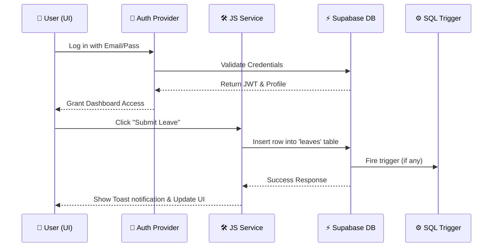
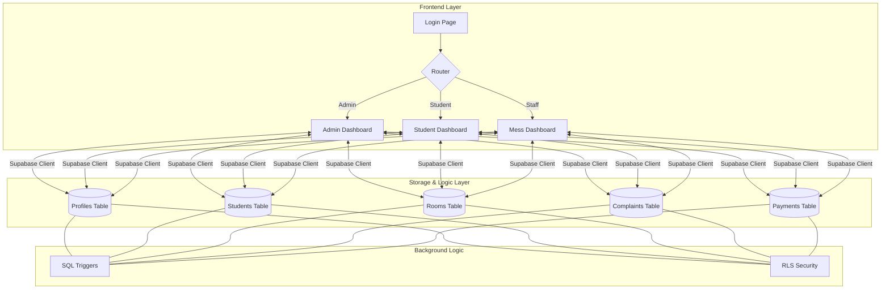

# 🚀 Campus Haven Manager: Complete Project Workflow

This document provides a 360-degree view of how the **Campus Haven Manager** project operates, covering technical architecture, user journeys, and database management.

---

## 🏛️ 1. Technical Architecture & Structure

The project follows a modern **Split-Architecture** pattern, separating the user interface from the database logic.

### Directory Layout
- **`/frontend`**: The React + Vite application. It handles everything the user sees and interacts with.
- **`/backend`**: The database "source of truth". Contains SQL schemas, RLS (Row Level Security) policies, and database triggers.
- **`Root`**: Automation scripts (`npm run dev`) that tie the two together.

### The Power Trio
1. **Frontend**: React, Tailwind CSS, Shadcn UI.
2. **Backend**: Supabase (PostgreSQL + Auth + Storage).
3. **State Management**: React Query (Server state) & Auth Context (User state).

---

## 🔄 2. The Core Data Flow

Whenever a user does something in the app, this is the journey the data takes:

---

## 🎭 3. User Role Workflows

The system morphs based on who logs in.

### 🛡️ Admin (The Controller)
1. **Login**: Authenticates as `role='admin'`.
2. **Dashboard**: Sees high-level stats (Occupancy, Payments, Pending Complaints).
3. **Operations**:
    - Adds a student email $\rightarrow$ System creates a placeholder record.
    - Approves a leave $\rightarrow$ Student receives instant update.
    - Manages Rooms $\rightarrow$ Updates availability globally.

### 🎓 Student (The Resident)
1. **Login**: Authenticates as `role='student'`.
2. **Dashboard**: Sees their specific room number and latest mess menu.
3. **Operations**:
    - **Payment**: Clicks pay $\rightarrow$ Transaction ID recorded $\rightarrow$ Status marks as "Paid".
    - **Complaints**: Reports a broken tap $\rightarrow$ Visible to Admin instantly.
    - **Leave**: Applies for home visit $\rightarrow$ Status shows "Pending" until Admin clicks approve.

### 🍳 Mess Staff (The Provider)
1. **Login**: Authenticates as `role='mess_staff'`.
2. **Operations**:
    - **Menu**: Updates the morning breakfast $\rightarrow$ Visible to all students.
    - **Inventory**: Tracks stock levels $\rightarrow$ Alerts if supplies are low.

---

## 🛠️ 4. Maintenance & Deployment Workflow

### Developer Daily Run
- **Start**: `npm run dev` (from root).
- **Edit**: Work inside `frontend/src`.
- **Verify**: Check `localhost:3000`.

### Database Updates (The Backend)
The backend is managed via SQL scripts. To "deploy" a backend change:
1. Open a script like `backend/supabase_schema.sql`.
2. Copy the contents.
3. Run it in the **Supabase Dashboard SQL Editor**.
4. This updates the "live" database that the frontend talks to.

---

## 📈 5. Visual System Map

---

> [!IMPORTANT]
> **Single Source of Truth**: All data is stored in Supabase. The frontend is just a "window" into that data. If the database is updated, the app reflects it immediately.
