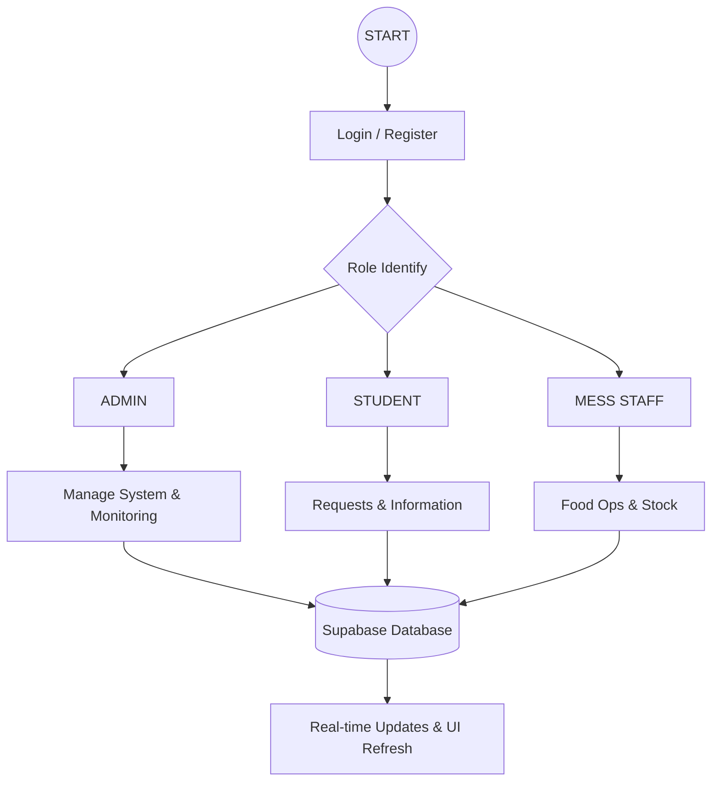

# HOSTEL MANAGEMENT SYSTEM – SYSTEM FLOW

## 🔐 1. Authentication Flow (Entry Point)
- **User Opens App**
- **Login / Register** (Supabase Authentication)
- **Role Identification** (Admin / Student / Mess Staff)
- **Redirect** to respective Dashboard

> [!NOTE]
> Role-based access ensures each user sees only relevant features and data.

---

## 🛡️ 2. Admin Flow (Management Side)
**Admin Dashboard** acts as the central control hub:

1.  **Student Management**: Track, add, or remove residents.
2.  **Infrastructure Management**: Manage Blocks & Rooms; track real-time occupancy.
3.  **Request Processing**: Review, approve, or reject student Leave Requests.
4.  **Issue Resolution**: Centralized dashboard to view and solve student Complaints.
5.  **Mess Management**: Update the dining menu for all users.
6.  **Payment Monitoring**: Track fees and student payment statuses.

---

## 🎓 3. Student Flow (User Side)
**Student Dashboard** focuses on personal convenience:

1.  **Dashboard Overview**: View room status and latest notifications.
2.  **My Room**: Check specific Block and Room details.
3.  **Mess Services**: View the weekly menu.
4.  **Financials**: Review and pay hostel/mess fees.
5.  **Support & Requests**: Submit formal complaints or apply for Leave Requests.

---

## 🍳 4. Mess Staff Flow (Operational Side)
**Mess Dashboard** handles daily kitchen operations:

1.  **Menu Management**: Update daily or weekly food offerings.
2.  **Attendance Tracking**: Monitor meal consumption and student attendance.
3.  **Inventory Management**: Manage kitchen stock and supplies.
4.  **Feedback Management**: View student complaints related to food and service.

---

## ⚙️ 5. Core System Flow
**User Login** → **Role Check** → **Dashboard Rendering**
- **Action Performed**: (e.g., Submitting a complaint)
- **Database Layer**: Data sent to Supabase.
- **Real-time Sync**: UI refreshes across the app.

### Core Features:
*   🔐 **Secure Authentication** (Supabase)
*   👤 **Profile Management** (with photo uploads)
*   📱 **Responsive UI** (Glassmorphism & Mobile-first)
*   ⚡ **Real-time Updates**
*   🔄 **Dynamic Role-based Navigation**

---

## 🔄 Overall System Flow Diagram

